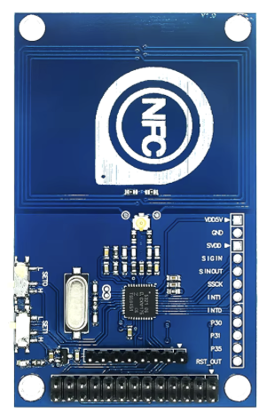
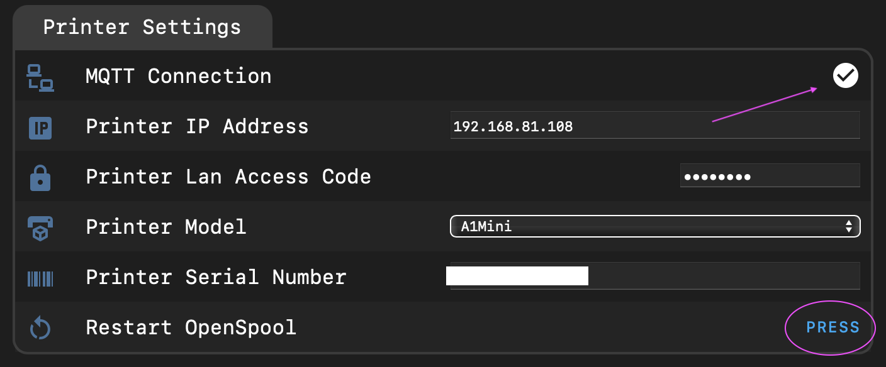
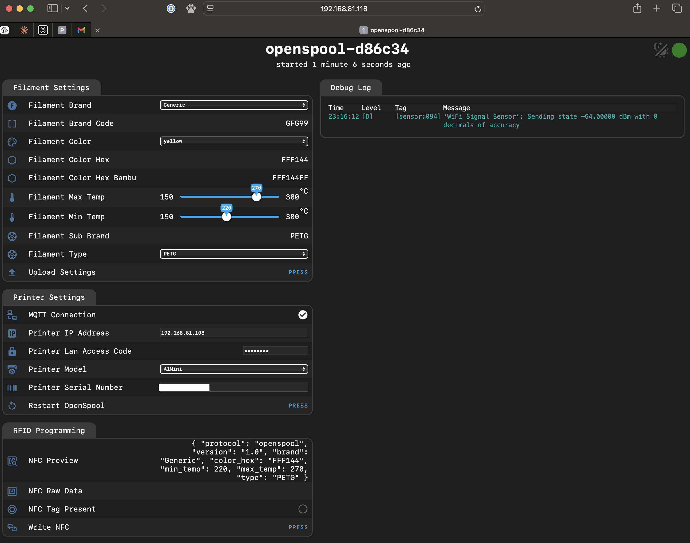

<p align=center>
    
</p>


# OpenSpool
**Your filament wants to be free**


[](https://discord.gg/4EaXHu9CEj)

---


# 📖 [OpenSpool.io](https://openspool.io)

Checkout the ofifical documentation on [https://openspool.io](https://openspool.io) 👈

---

Adhere NFC stickers on all your filament. Build an ESP32 OpenSpool reader and place it next to your printer. 
Touching the filament to the reader will automatically update your Bambu Printer filament settings. 
Almost as seamlessly as if you were using Bambu filament with an AMS. 

## Objectives

- Make it so easy to put RFID stickers on filament spools that your grandma could do it. 
- 100% programable using just a modern iphone/android (no RFID programmer or scripting).
- Change filament in 10 seconds using 1 hand. 
- 100% reliability so that filament can be changed with your eyes closed. 

## 🎥 Demo

[](https://youtube.com/watch?v=ah7dm-dtQ5w)
[](https://youtube.com/shorts/pWnvJc-8KLI?si=9-C1rhqrvL1i5CpR)
[](https://www.youtube.com/shorts/kvVpRKFNU9k)


## 🖨️ Protocol


| Protocol | Read | Write | Type | 
|----------------|------|-------|-------|
| OpenSpool  | ✅    | ✅     | NTAG 215/216 | 
| Bambu         | 🚧 In progress       | ❌     | MiFare Classic | 
| OpenTag  | 🚧 In progress  | 🚧 In progress    | TBD: Either MiFare or NTAG | 
| Creality       | ❓    | ❓     | ❓ | 
| PrusaRFID      |❓    | ❓     | ❓ |

### 🧬 OpenSpool Protocol

OpenSpool aims to use the simplest possible protocol for RFID tags. All you need is a [13.56Mhz RFID tag](https://a.co/d/5ojDUNk) that supports NDEF records (NFC Tags) and has atleast 500 bytes of memory. NTAG 215/216 are a great choice. Purchasing links provided below. 

#### NDEF Record

Example record stored on NFC tag. 

type = `application/json`  
payload = 

```json
{
    "protocol": "openspool",
    "version": "1.0",
    "type": "PLA",
    "color_hex": "FFAABB",
    "brand": "Generic",
    "min_temp": "220",
    "max_temp": "240"
}
```


#### Web Preview

By touching your phone to a spool tag, you can see information about the spool. 


```
https://openspool.io/tag_info?color_hex=FFAABB&type=PLA&brand=Generic&min_temp=220&max_temp=240&protocol=openspool&version=1.0
```


## 🐼 Integrations

Currently OpenSpool works with Bambu printers over mqtt. Other integrations are planned. Pull Requests welcome

| Integration | Supported |
| --- | --- |
| Bambu | ✅ |
| Anker | ❔ | 
| Prusa Connect | ❔ |
| OctoPrint | ❔ |
| SpoolMan | ❔ |
| Klipper / Moonraker | ❔ |

## 🔧 Hardware

OpenSpool requires an ESP32-S2 and PN532 NFC Reader (SPI Mode).


| | Hardware | Link 1 | Link 2| 
| --- | --- | --- | --- | 
| | Wemos D1 Mini S2 (Beware of Fakes!)| [Amazon](https://amzn.to/4fqq9m7) | [Aliexpress](https://www.aliexpress.us/item/3256802958877264.html)|
|  |  PN532 (Large) (Beware of Fakes!) | [Amazon](https://amzn.to/40CVE7R) | [Aliexpress](https://www.aliexpress.us/item/3256806348384449.html)|
|  |  PN532 (Small) | [Amazon](https://amzn.to/4eoBz8s) | [Aliexpress](https://www.aliexpress.us/item/3256805787598774.html)| 
|  | NTAG 215/216 (13.56Mhz NFC Tags >500 bytes) | [Amazon](https://amzn.to/4epJzpO) | | 
|  | WS2812B LED | [Amazon](https://amzn.to/40FFOt5) | |
|  | 2.54mm Headers | [Amazon](https://amzn.to/4en6138) | | 
|  | 3.3v - 5v Logic Level Converter | [Amazon](https://amzn.to/3UMfMkp) | | 
|  | female-female jumper wire) | [Amazon](https://amzn.to/3AMwRDM) | | 

| Tag | Bytes | Supported |  
| --- | --- | --- |  
| NTAG 213 | 144 bytes | ❌ | 
| NTAG 215 | 504 bytes | ✅ |  
| NTAG 216 | 888 bytes | ✅ |   

### Caution of Fakes

There is a plethora of fake D1 Mini S2 microcontrollers and PN532 RFID readers in the market. 
For the D1 Mini microcontroller, you need the `ESP32-S2FN4R2` not the `ESP32-S2FH4`. 
For the PN532 RFID reader, you need the model that contains the silkscreen. 

While temping to buy a fake/clone esp32 or PN5432 at a lower cost, they inevitibly cause headaches as they are less reliable at reading NFC tags. 
Purchasing at reputable vendors is highly recomended. 
If you do find a cheaper price and have verified reliablity, please let us know. 

# Wiring Diagram


Be sure to put the PN532 into `SPI` mode (not `i2c` or `UART`)


## 🤖 Firmware

The recomended method to install firmware is by navigating to [openspool.io](https://openspool.io) in Chrome/Edge and using the web based programming tool. 

Alternativly the firmware can be installed with `make` commands as shown below. 

### OSX/Linux

```
brew install esphome

git clone https://github.com/spuder/OpenSpool
cd OpenSpool/firmware
```

Press and hold the D0 button while pressing the reset button on the Wemos D1 Mini.  
A new usb serial device will appear. 

```bash
ls /dev/cu*
```

Upload firmware and restart

```bash
USB_ADDRESS=/dev/cu.usbmodemXXXXX make run-usb-pcb-mini
```

## 🛜 First Time Configuration

A new wifi network will appear called `OpenSpool`, join the network, navigate to [192.168.4.1](http://192.168.4.1),  insert your wifi credentials and reboot. 

You can then navigate to the web interface at `openspool-xxxxxx.local` or ip address. 


## 🎛️ Configuration

On first boot, you will need to specify your 3d printer IP Address, Serial Number and Lan Access Code. 

Do not put your printer into LAN Only Mode, it is not required. 



After changing these 3 settings, you will need to reboot the ESP32. 
Upon successful connection to the 3d printer, you will observe a checkmark next to MQTT in the web interface, and a blue LED will illuminate next to the USB port. 




## Factory Reset

Press and hold the D0 button for 10 seconds. 
This will erase wifi credentials and bambu access credentials from OpenSpool. 

# 🔧 Troubleshooting

### LED is breathing blue
This means the OpenSpool is hosting a wireless access point called 'OpenSpool'. Connect to it then navigate to [192.168.4.1](http://192.168.4.1) to configure wifi. 

### LED is solid white
OpenSpool has succesfully joined the wifi network and is ready to scan for RFID tags


### NFC Tags aren't reading reliably

If using the red NP5332 reader (smaller model), it detects tags best on the corners of the antenna. 

If using the blue PN532 reader (larger model), it detects tags best directly in the center of the antenna.   

Be sure you aren't using a [counterfit PN532](https://forum.dangerousthings.com/t/success-pn532-is-not-easy-to-work-with/1108/10)

### MQTT Disconnects

The A1/P1 have a limit of 4 mqtt connections. If more than 4 connections are reached clients may be asked to disconnect. 

If a client attempts to write invalid data any mqtt topic, the printer will ask the client to disconnect. 
All esphome resources must use `state_topic:` with a null value to prevent esphome from broadcasting on any topic. 


### TLS Errors

Reach out to the discord for help verifying that the Root Certificate is correct. 


### Advanced Troubleshooting

Use the [MQTTX client](https://mqttx.app) to observe the messages that OpenSpool and Bambu Printer are sending. 


```bash
mqttx sub -t 'device/$SERIAL_NUMBER/report' -u -P $LAN_ACCESS_CODE --mqtt-version 3.1.1 -h $IP_ADDRESS -p 8883 -l mqtts --insecure
```

### Contributors

<!-- readme: contributors -start -->
<table>
	<tbody>
		<tr>
            <td align="center">
                <a href="https://github.com/spuder">
                    
                    <br />
                    <sub><b>Spencer Owen</b></sub>
                </a>
            </td>
            <td align="center">
                <a href="https://github.com/thomasjpatterson">
                    
                    <br />
                    <sub><b>secprepper</b></sub>
                </a>
            </td>
		</tr>
	<tbody>
</table>
<!-- readme: contributors -end -->

# 🪪 License


<p xmlns:cc="http://creativecommons.org/ns#" >Software, Hardware and 3d models are released under <a href="https://creativecommons.org/licenses/by-sa/4.0/?ref=chooser-v1" target="_blank" rel="license noopener noreferrer" style="display:inline-block;">CC BY-SA 4.0</a></p>
