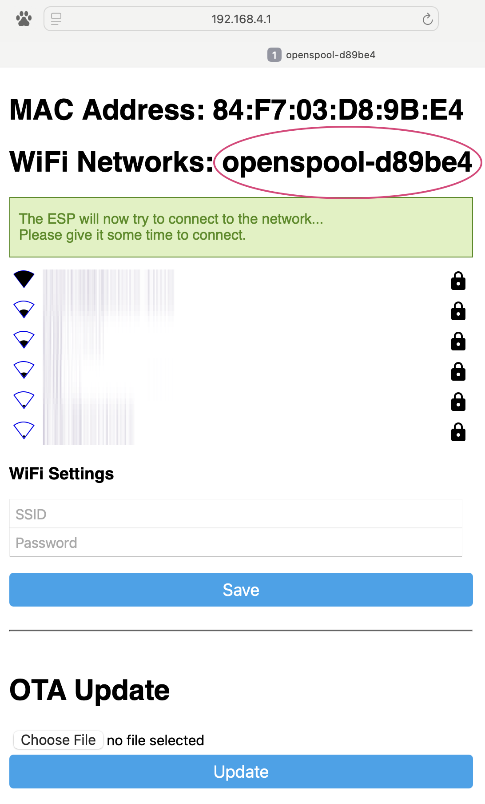

# 📟 OpenSpool Firmware Installation

    

    <h2> 🔩 Install the firmware</h2>
    
    

        <esp-web-install-button 
            manifest="https://openspool.io/firmware/manifest.json">
         <b>Only  /  Supported</b> 

        🔒 HTTPS Required 🔒 
        </esp-web-install-button>
    

    

        <h3>Installation Instructions</h3>
        
1. Connect your OpenSpool device via USB

        
2. Press & Hold D0 Button

        
3. Press RST Button

        
4. Release both D0 and RST simultaneously

        
5. Click the blue 'Connect' button above

        
6. Follow the installation wizard

    

{: .caution }
If the above step fails, see the [README on github](https://github.com/spuder/OpenSpool) to upload manually with command `make run-usb-pcb`. 

# 🛠️ Configuration

Once the firmware is installed, You will need to join the RFID reader to the same network as your 3d printer. 

## 🛜 Wireless Configuration

1. Join the wifi network `OpenSpool`
2. Navigate to [192.168.4.1](http://192.168.4.1)
3. Enter your wifi credentials (take note of the mac address, you will need it to connect)
4. Reboot the RFID Reader

After reboot connect to http://openspool-d89be4.local (where d89be is your specific mac address)

## 🖨️ Printer Configuration

Once openspool has joined your network, navigate to `openspool-xxxxxx.local`, or ip address (where xxxxxx are the last 6 digits of the mac address).

If you forgot the mac address, or if you computer is unable to resolve `.local` domains. You can always connect via ip address. To find the ip address, consult your router documentation, or search your arp table. Instructions below. 

{: .note-title } 
> Finding IP Address via ARP Tables
>
> Mac/Linux:  `arp -a | grep openspool`  
> Windows: `arp -a` 

Enter your Printer IP, LAN Access Code and Serial Number

{: .note-title }
> Security
>
> `Printer IP`, `Lan Access Code` and `Serial Number` are stored locally on the microcontroller and never leave the device. Do not share your Acces Code with anyone. 

